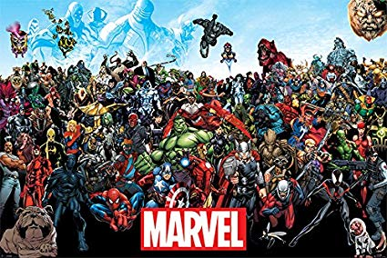

import { Appear, Image } from "mdx-deck";
import { FullScreenCode, SplitRight } from "mdx-deck/layouts";
export { dark as theme } from "mdx-deck/themes";

# Hooks aren't just

# for fishing ....


---

# About Me


```notes
What do I say about CJC?
```

---

# What this talk is

<div style={{ fontSize: 40, textAlign: "left" }}>
  <ul>
    <Appear>
      <li>
        <a href="https://github.com/kentcdodds/react-testing-library">
          react-testing-library
        </a>
      </li>
      <li>
        <a href="https://github.com/kentcdodds/downshift">downshift</a>
      </li>
      <li>
        <a href="https://github.com/kentcdodds/babel-plugin-macros">
          babel-plugin-macros
        </a>
      </li>
      <li>
        <del>
          <a href="https://github.com/paypal/glamorous/issues/419">glamorous</a>
        </del>{" "}
        <a href="https://emotion.sh">emotion</a>
      </li>
    </Appear>
  </ul>
</div>

---

# What this talk is Not

<div style={{ fontSize: 40, textAlign: "left" }}>
  <ul>
    <Appear>
      <li>
        <a href="https://github.com/kentcdodds/react-testing-library">
          react-testing-library
        </a>
      </li>
      <li>
        <a href="https://github.com/kentcdodds/downshift">downshift</a>
      </li>
      <li>
        <a href="https://github.com/kentcdodds/babel-plugin-macros">
          babel-plugin-macros
        </a>
      </li>
      <li>
        <del>
          <a href="https://github.com/paypal/glamorous/issues/419">glamorous</a>
        </del>{" "}
        <a href="https://emotion.sh">emotion</a>
      </li>
    </Appear>
  </ul>
</div>

---

# Example using jsx

```jsx
const Button: React.SFC<NavigationRootProps> = ({ title }) => (
  <CardContainer>
    <StyledButton>{title}</StyledButton>
  </CardContainer>
);
```

---

# Importing a component sorta....

import Counter from "./components/Counter.js";

<button onClick={() => console.log("You clicked the button!!!!!")}>
  Test Button
</button>

---

# Using an image

<Image size="400" src="./img/test.jpg" />

---

# Using an image

<Image size="200" src="./img/TestCode.png" />

---

# Bullet points

- Typical lifecycle of a component <br /><small>(not what you're thinking)</small>
- How patterns can simplify
- Composability
- A challenge

---

# Click arrow add item

<div style={{ fontSize: 40, textAlign: "left" }}>
  <ul>
    <li>
      <strong>How</strong> to implement patterns
    </li>
    <Appear>
      <li>
        <a href="https://github.com/kentcdodds/react-testing-library">
          react-testing-library
        </a>
      </li>
      <li>
        <a href="https://github.com/kentcdodds/downshift">downshift</a>
      </li>
      <li>
        <a href="https://github.com/kentcdodds/babel-plugin-macros">
          babel-plugin-macros
        </a>
      </li>
      <li>
        <del>
          <a href="https://github.com/paypal/glamorous/issues/419">glamorous</a>
        </del>{" "}
        <a href="https://emotion.sh">emotion</a>
      </li>
    </Appear>
  </ul>
</div>

---

# Full Screen Code

export default FullScreenCode;

```jsx
<Button>Beep</Button>
```

---

export default SplitRight;



## SplitRight
